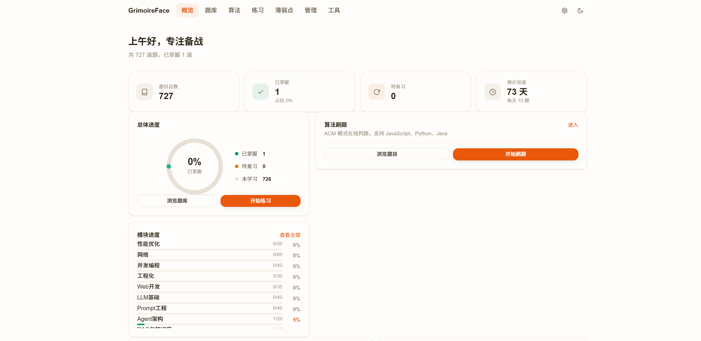
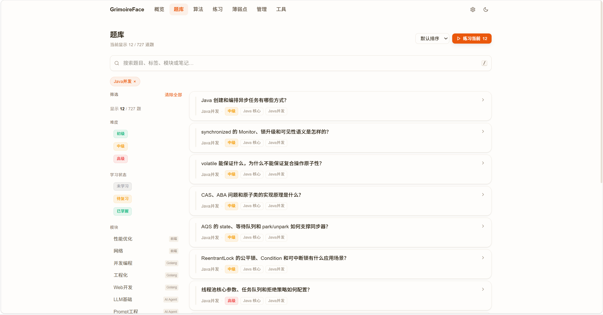
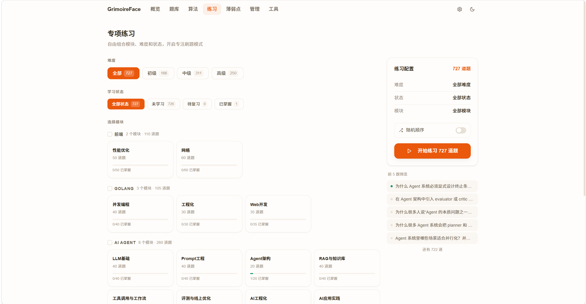
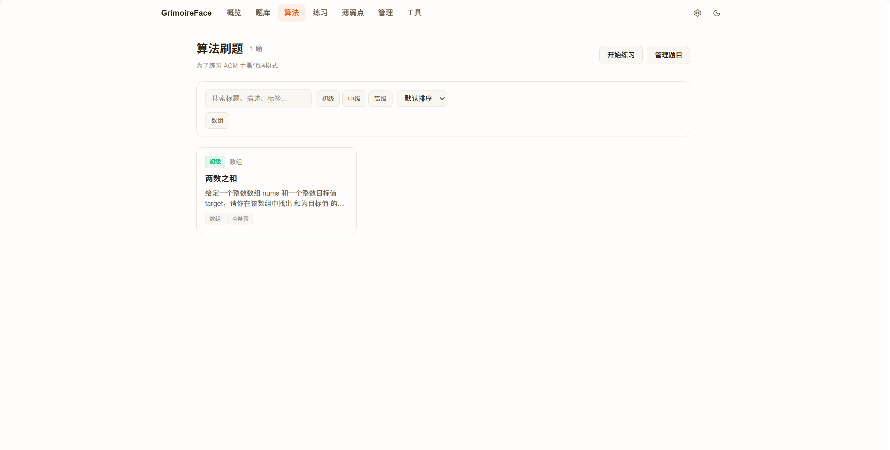
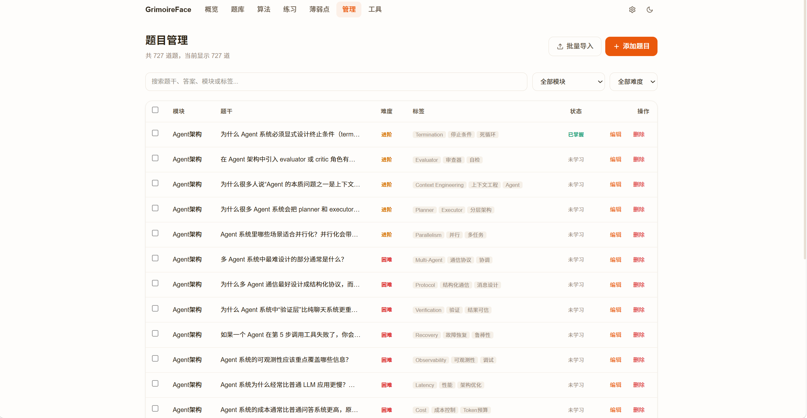
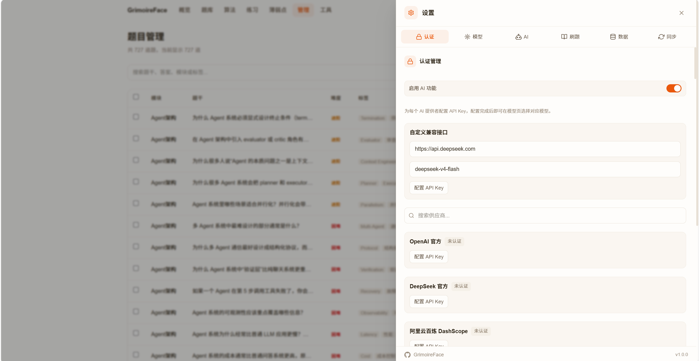
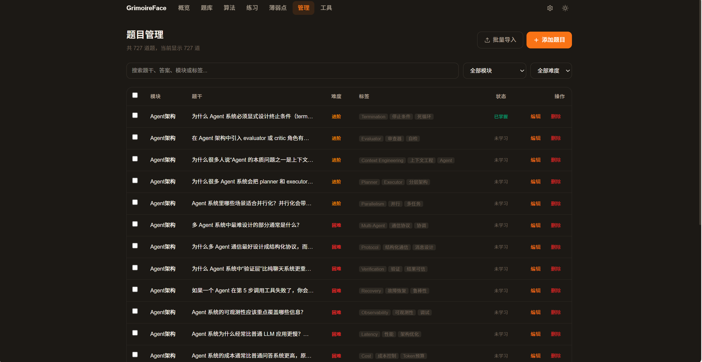

# GrimoireFace

[English](./README.md) | 简体中文

基于 Vue 3 和 Vite 构建的面试练习助手。GrimoireFace 通过结构化的题库、模拟面试、算法练习和 AI 工具，帮助你系统备战技术面试 —— 所有数据均在浏览器本地运行，支持 PWA 离线使用。

> 本项目源自 [Dogxi](https://github.com/Dogxi) 的 [iFace](https://github.com/Dogxi/iFace)。感谢这个开源基础。

## 功能特性

- **题库** — 浏览、搜索和管理多分类面试题（前端、Go、Java、网络、系统设计等）
- **练习模式** — 配合间隔重复追踪和学习进度统计进行复习
- **模拟面试** — 计时模拟真实面试场景，支持 AI 反馈
- **薄弱点** — 识别并回顾需要加强的知识点
- **JD 匹配** — 根据职位描述分析你的技能匹配度
- **AI 工具** — 内置 AI 助手，辅助编程和解答疑惑
- **算法练习** — 记录算法题目、提交情况和笔记
- **导入与管理** — 从 JSON 导入题库，本地管理所有数据
- **PWA 支持** — 可安装为桌面/移动应用，支持离线缓存

## 界面预览

| 首页 | 题库 | 练习模式 |
| :------: | :-----------: | :-----------: |
|  |  |  |

| 算法练习 | 数据管理 | 设置 | 深色模式 |
| :-------: | :---------: | :------: | :-------: |
|  |  |  |  |

## 技术栈

- [Vue 3](https://vuejs.org/) — 渐进式 JavaScript 框架
- [Vite](https://vitejs.dev/) — 下一代前端构建工具
- [TypeScript](https://www.typescriptlang.org/) — 类型安全的 JavaScript
- [Tailwind CSS v4](https://tailwindcss.com/) — 原子化 CSS 框架
- [Pinia](https://pinia.vuejs.org/) — 状态管理
- [Vue Router](https://router.vuejs.org/) — 客户端路由
- [idb](https://github.com/jakearchibald/idb) — IndexedDB 封装，用于本地数据存储
- [vite-plugin-pwa](https://vite-pwa-org.netlify.app/) — PWA 能力支持

## 环境准备

首次运行前，请确保已安装：

- **Node.js** ≥ 18（推荐最新 LTS 版本）
- **npm** ≥ 9（随 Node.js 附带）

> 或者你也可以使用 [Bun](https://bun.sh/) 替代 npm。

## 快速开始

### 1. 克隆仓库

```bash
git clone https://github.com/lokidundun/GrimoireFace.git
cd GrimoireFace
```

### 2. 安装依赖

```bash
npm install
```

### 3. 启动开发服务器

```bash
npm run dev
```

应用将在 `http://localhost:5173/` 运行。

### 4. 生产构建

```bash
npm run build
```

构建产物将输出到 `dist/` 目录。

### 5. 预览生产构建

```bash
npm run preview
```

## 项目结构

```
GrimoireFace/
├── public/              # 静态资源
├── src/
│   ├── components/      # 可复用 Vue 组件
│   ├── composables/     # Vue 组合式函数
│   ├── data/            # 静态数据和种子文件
│   ├── lib/             # 核心工具（数据库、AI 客户端等）
│   ├── pages/           # 路由级页面组件
│   ├── router/          # Vue Router 配置
│   ├── stores/          # Pinia 状态仓库
│   ├── types/           # TypeScript 类型定义
│   ├── App.vue          # 根组件
│   └── main.ts          # 入口文件
├── index.html
├── package.json
├── tsconfig.json
├── vite.config.ts
└── LICENSE
```

## 数据存储

所有数据均通过 IndexedDB **本地存储**在浏览器中，无需服务器或云端账号。你可以：

- 从 JSON 文件导入题库
- 导出学习进度和笔记
- 随时清空浏览器中的全部数据

## 致谢

本项目灵感来源于 [Dogxi](https://github.com/Dogxi) 的 [iFace](https://github.com/Dogxi/iFace)，基于 MIT 协议开源。

## 许可证

本项目采用 [MIT 许可证](./LICENSE) 开源。
